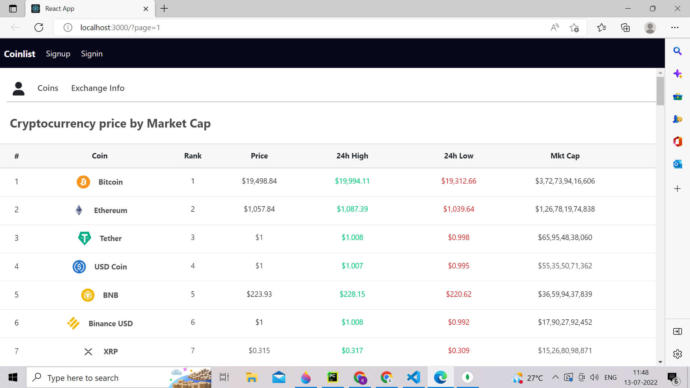
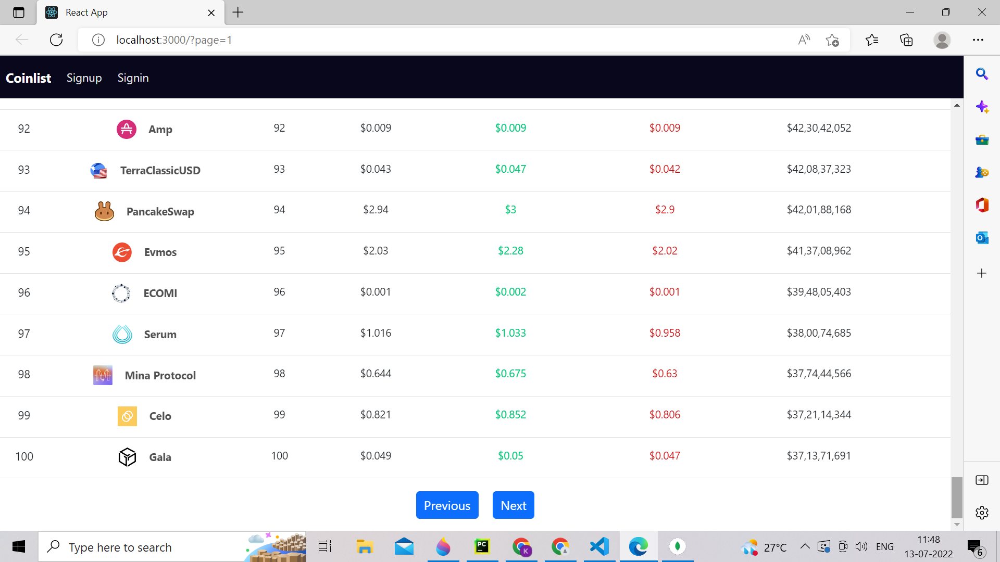
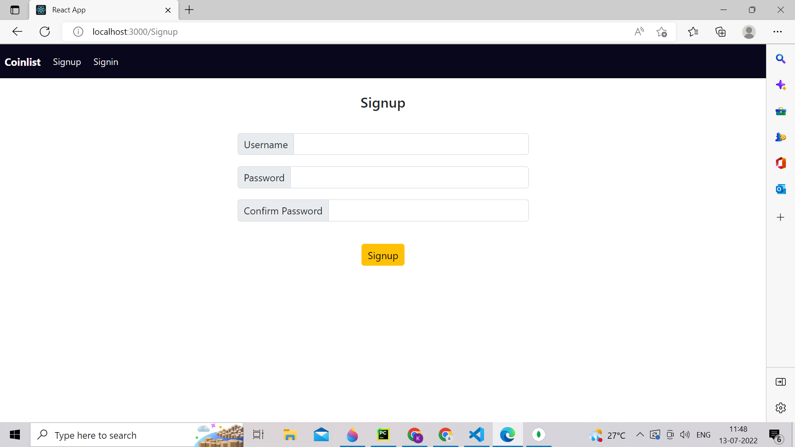
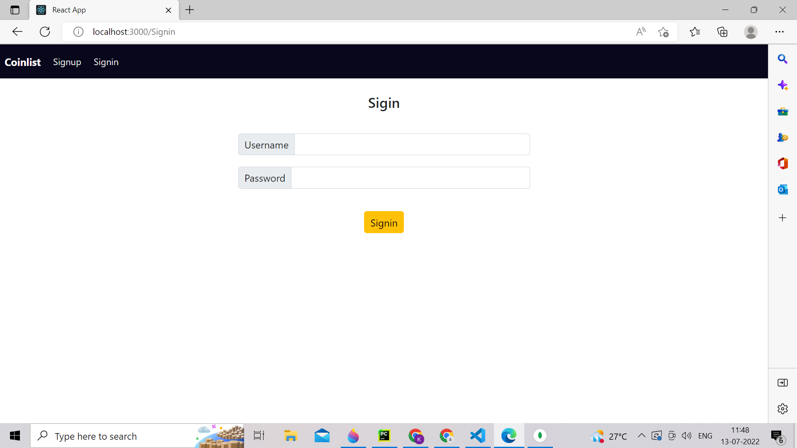
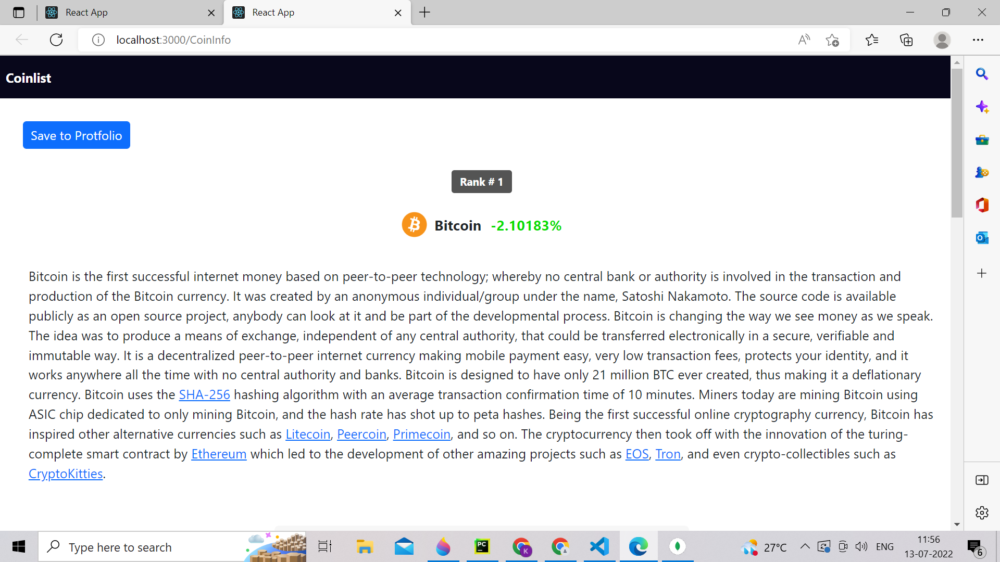
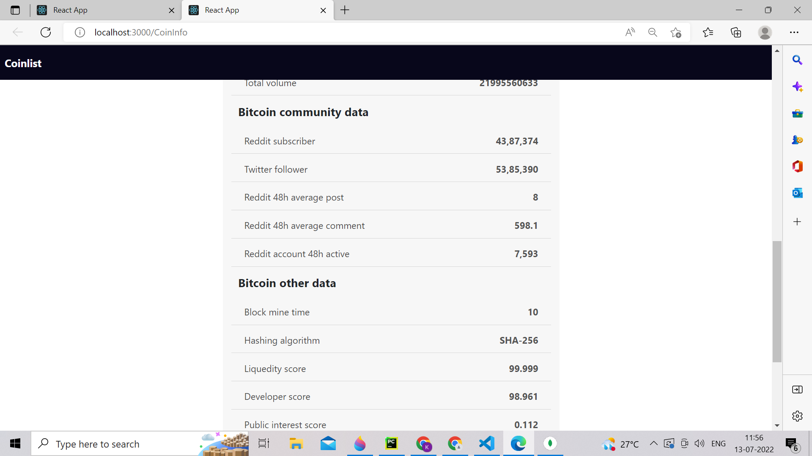
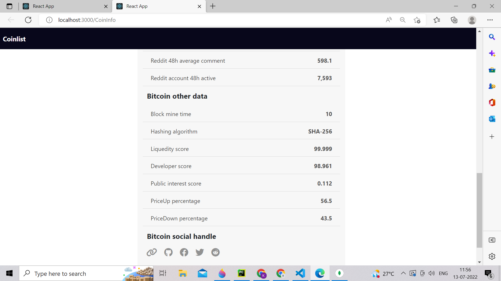
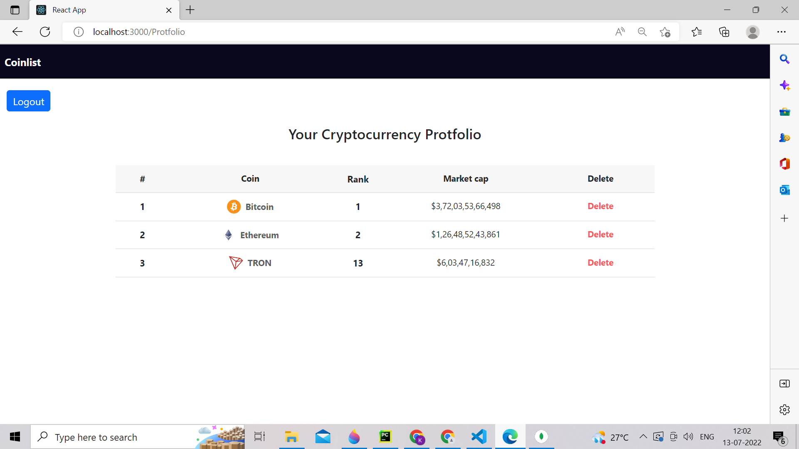

# Cryptocurrency-coinlist-Website

# About Project 

Display information about a cryptocurrency coin's current price, 24 hour high and low prices, and market capitalization.  
User can also access in-depth information on a specific coin.  
Additionally, users can create accounts with the ability to save specific coins.  
Additionally, provide a tradingview chart for a certain coin.  
We offer data on more than 3000 cryptocurrency coins.  

# About API Information 

We use coingecko api for coins data .

[API](https://www.coingecko.com/) 

# Command for Run Project 

1. Go to project root directory 

npm run start
nodemon ./Backend/index.js 

# Overview of Project

1. Main Page Overview 

   
   

2. Signup Page 

 
   

3. Particular coin Information Overview

 
 
  

4. Protfolio information Overview

